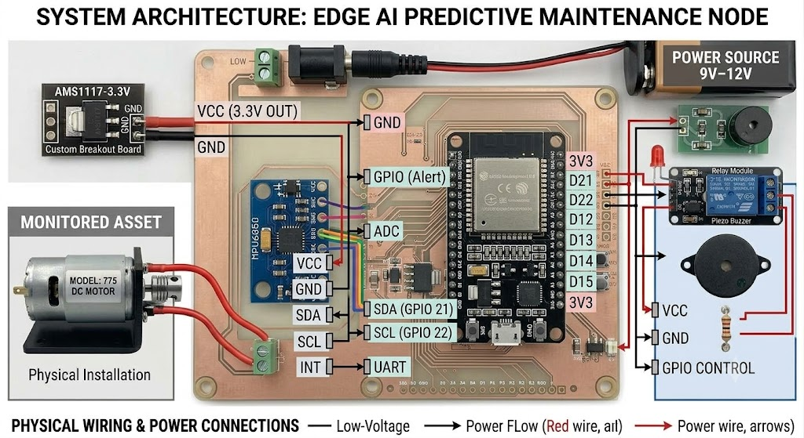

# Edge AI Predictive Maintenance Node ⚙️🧠

An IoT sensor node utilizing TinyML to detect mechanical anomalies at the edge. This project uses an ESP32 and an MPU6050 accelerometer to capture motor vibration data, classify it locally using a trained neural network, and trigger alerts for predictive maintenance without relying on cloud processing.

## Features
* **Edge Inferencing:** Machine learning model runs directly on the ESP32 (TinyML).
* **Low Latency:** Processes vibration data in real-time.
* **Offline Operation:** No continuous Wi-Fi connection required for anomaly detection.
* **Custom PCB Ready:** Designed with KiCad for easy transition from breadboard to printed circuit board.

## Hardware Components
* **ESP32 Development Board** (NodeMCU or similar)
* **MPU6050** 3-Axis Accelerometer and Gyroscope
* **DC Motor** (Target machine for monitoring)
* Jumper wires & Breadboard (or Custom PCB)

## Circuit Diagram
| MPU6050 Pin | ESP32 Pin | Function |
| :--- | :--- | :--- |
| VCC | 3V3 | Power |
| GND | GND | Ground |
| SCL | GPIO 22 | I2C Clock |
| SDA | GPIO 21 | I2C Data |

## Interactive Visualization

> 🔗 **[Click here to view the Interactive Visualization](https://vishwaswami24.github.io/Edge_AI/interactive_visualization.html)**
>
> *(Hosted via GitHub Pages — shows live system data flow and model inference visualization)*

---

## Step 1: Data Collection
1. Flash `src/data_collection/data_collection.ino` to the ESP32.
2. Mount the MPU6050 securely to the motor casing.
3. Use `scripts/serial_logger.py` to record CSV data, or use the **Edge Impulse CLI Data Forwarder** to stream data directly to your project.
4. Record 10 minutes of "Normal" operation and 10 minutes of "Anomaly" operation (e.g., motor with an unbalanced load).

## Step 2: Model Training (Edge Impulse)
1. Upload the dataset to [Edge Impulse](https://www.edgeimpulse.com/).
2. Create an Impulse: `Time series data` -> `Spectral Analysis` -> `Neural Network (Keras)`.
3. Train the model until accuracy exceeds 90%.
4. Export the deployment as an **Arduino Library** and add it to your Arduino IDE.

## Step 3: Edge Deployment
1. Open `src/edge_inferencing/edge_inferencing.ino`.
2. Change the library include `<Your_Edge_Impulse_Project_inferencing.h>` to match the name of your exported library.
3. Flash to the ESP32. The system will now print classification results to the Serial Monitor in real-time.